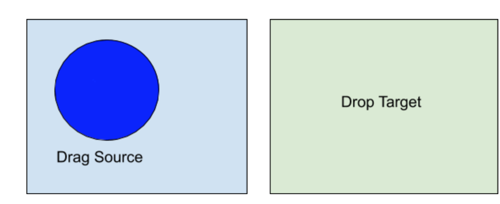

# HTML5 Drag and Drop API

## Drag Source and Drop Target

- Drag Source
被點擊要拖曳的物件
- Drop Target
拖曳物件被放置的位置

## DragEvent 事件

| Drag Source |Drop Target |
|----------|:-------------:|
| drag     |  dragenter    |
| dragstart|  dragover     | 
|          |  dragleave    |
|          |  drop         | 
| dragend  | right-aligned |

- Drag Source
  1. drag: 在drag source 被拖曳時會持續被觸發
  2. dragstart: 開始拖曳一個元素或方塊時觸發
  3. dragend: 拖曳結束後觸發(滑鼠放開)

- Drop Target

  1. dragenter: 元素進入一個有效放置的目標時觸發(container)
  2. dragleave: 一個元素被拖曳移動離開一個放置目標時觸發(container)
  3. dragover: 當拖曳的drag source 在drop target 上方時，會持續被觸發
  4. drop：一個元素選取區塊被放置一個有效的放置目標時觸發(滑鼠放開)
